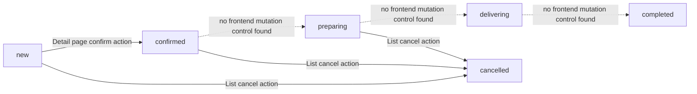

# Order Lifecycle

This document reflects the **current frontend source of truth** for order status handling.

The implemented UI model is defined in `src/lib/orders/config.ts` and used by the orders list and order detail screens. Based on the current implementation, the frontend lifecycle is the **6-status model**, not a larger 12-status workflow.

## Source of Truth Decision

**Chosen source of truth:** the currently implemented frontend statuses:

- `new`
- `confirmed`
- `preparing`
- `delivering`
- `completed`
- `cancelled`

### Why this is the current source of truth

- `src/lib/orders/config.ts` defines the canonical filter/status option list as exactly those six statuses.
- `src/app/(app)/orders/page.tsx` builds the status filter chips directly from `statusOptions`, so only those six statuses are filterable in the list UI.
- `src/app/(app)/orders/[id]/page.tsx` only mutates status to `confirmed` from the detail page.
- `src/app/(app)/orders/page.tsx` mutates status to `cancelled` for single-order and bulk cancellation flows.
- No UI path currently mutates orders into any additional intermediate states from a larger 12-status lifecycle.

## Status Table

| Status | Rendered badge/meta | Filter chip | Mutated from UI | Cancellable in UI | Notes |
|---|---|---:|---:|---:|---|
| `new` | Yes | Yes | No direct mutation path found | Yes | Initial active order state in the configured frontend model. |
| `confirmed` | Yes | Yes | Yes | Yes | Set from the order detail page via **Confirm order** flow. |
| `preparing` | Yes | Yes | No direct mutation path found | Yes | Rendered/filterable only; no explicit mutation control is implemented in the current UI. |
| `delivering` | Yes | Yes | No direct mutation path found | No | Rendered/filterable only; not cancellable in the current UI metadata. |
| `completed` | Yes | Yes | No direct mutation path found | No | Terminal state in current frontend config. |
| `cancelled` | Yes | Yes | Yes | No | Set by list-page cancellation actions, including provider-aware cancellation flows. |

## Rendering and Filtering Behavior

### Orders list (`src/app/(app)/orders/page.tsx`)

- The status chips are created from `statusOptions`, which is generated from `orderConfig.statuses` in `src/lib/orders/config.ts`.
- This means the orders list only exposes filters for:
  - `new`
  - `confirmed`
  - `preparing`
  - `delivering`
  - `completed`
  - `cancelled`
- Row badges are rendered from `statusMeta`.
- If an order arrives with a status that is not part of the configured UI model, the list falls back to `statusMeta.pending` for badge rendering. This is fallback presentation behavior, **not** evidence of a supported lifecycle state in the current frontend workflow.

## UI Mutation Paths

### Confirm

The order detail page updates an order to:

- `confirmed`

There is no corresponding UI control in the inspected pages for mutating an order from `confirmed` to `preparing`, `delivering`, or `completed`.

### Cancel

The orders list updates an order to:

- `cancelled`

Cancellation exists in:

- single-order list actions
- bulk cancellation
- provider-specific cancellation dispatch before the local order record is updated to `cancelled`

## Transition Diagram

### Diagram interpretation

- **Solid arrows** represent status changes that are explicitly driven by the current UI.
- **Dotted arrows** represent lifecycle progression that may exist conceptually or in backend/provider systems, but is **not currently mutated by the inspected frontend pages**.
- `delivering` and `completed` are displayed by the UI when present on orders, but the inspected UI does not provide controls to set them.

## Integration Mapping

This section maps the inspected UI actions to the status values they can set or propagate.

| Integration / path | Where in UI | External/provider action | Local OrderOps status mutation |
|---|---|---|---|
| Internal/manual order | Orders list | No provider dispatch | `cancelled` |
| Syrve send-to-POS | Orders list / detail page | Sends order to Syrve / stores `syrve_order_id` | No local status mutation found |
| Bitrix | Orders list cancel flow | Bitrix cancel action | `cancelled` |
| Salesbox | Orders list cancel flow | Salesbox status set to `cancelled` | `cancelled` |
| Bolt Food | Orders list cancel flow | Bolt `reject_order` action | `cancelled` |
| Glovo | Orders list cancel flow | Platform status push `cancelled` | `cancelled` |
| Wolt | Orders list cancel flow | Platform status push `cancelled` | `cancelled` |
| Uber Eats | Orders list cancel flow | Platform status push `cancelled` | `cancelled` |
| Menu.ua | Orders list cancel flow | Platform status push `cancelled` | `cancelled` |
| Detail-page confirm flow | Order detail page | No provider status push in the inspected code | `confirmed` |

## Practical Conclusion

The current frontend does **not** consistently implement a 12-status lifecycle.

Until the codebase adds those extra states to:

- `src/lib/orders/config.ts`
- list filter chips
- badge metadata
- status mutation controls
- provider/status dispatch rules where needed

…the documentation should describe the **implemented 6-status model** as the frontend lifecycle source of truth.
